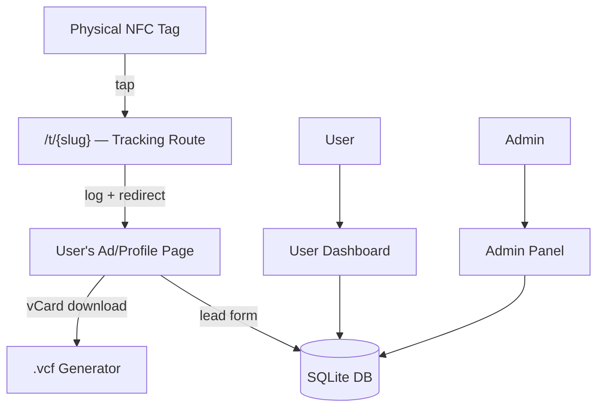

# Smart NFC Business Card Platform — Implementation Plan

A full-stack web application for issuing and managing dynamic NFC business cards with real-time analytics, a user dashboard, and an admin command center.

---

## Architecture Overview



---

## Project Structure

```
c:\Users\USER\Desktop\nfc cards\
├── app.py                    # Flask app factory & routes
├── models.py                 # SQLAlchemy models
├── schema.sql                # Raw SQL schema (reference)
├── requirements.txt
├── config.py                 # Config (dev/prod)
├── templates/
│   ├── base.html
│   ├── auth/
│   │   ├── login.html
│   │   └── register.html
│   ├── dashboard/
│   │   ├── index.html        # User home
│   │   ├── cards.html        # Card management
│   │   ├── analytics.html    # Personal analytics
│   │   └── profile.html      # Profile & template editor
│   ├── admin/
│   │   ├── index.html        # System health
│   │   ├── heatmap.html      # Traffic heatmap
│   │   └── users.html        # User control
│   ├── public/
│   │   └── card.html         # Public advertisement/profile page
│   └── redirect.html         # Invisible redirect (fallback)
├── static/
│   ├── css/
│   │   └── main.css          # Tailwind + custom styles
│   ├── js/
│   │   ├── dashboard.js      # Charts (Chart.js)
│   │   └── editor.js         # Profile template editor
│   └── uploads/              # User-uploaded logos
└── nfc.db                    # SQLite database
```

---

## Database Schema (SQL)

### `users`
| Column | Type | Notes |
|---|---|---|
| id | INTEGER PK | |
| username | TEXT UNIQUE | |
| email | TEXT UNIQUE | |
| password_hash | TEXT | bcrypt |
| business_name | TEXT | |
| subscription | TEXT | `free` / `pro` / `enterprise` |
| is_admin | BOOLEAN | default 0 |
| is_suspended | BOOLEAN | default 0 |
| created_at | DATETIME | |

### `nfc_cards`
| Column | Type | Notes |
|---|---|---|
| id | INTEGER PK | |
| unique_id | TEXT UNIQUE | slug e.g. `alpha1` |
| user_id | INTEGER FK | → users.id |
| target_url | TEXT | redirect destination |
| label | TEXT | friendly name |
| is_active | BOOLEAN | default 1 |
| created_at | DATETIME | |

### `tap_analytics`
| Column | Type | Notes |
|---|---|---|
| id | INTEGER PK | |
| card_id | INTEGER FK | → nfc_cards.id |
| timestamp | DATETIME | |
| device_type | TEXT | `mobile` / `desktop` / `tablet` |
| browser | TEXT | UA-parsed |
| ip_address | TEXT | hashed for privacy |
| referrer | TEXT | |

### `leads`
| Column | Type | Notes |
|---|---|---|
| id | INTEGER PK | |
| card_id | INTEGER FK | → nfc_cards.id |
| name | TEXT | |
| email | TEXT | |
| phone | TEXT | |
| message | TEXT | |
| captured_at | DATETIME | |

---

## Core Features & Routes

### Authentication (`/auth/`)
- `GET/POST /auth/login` — Login form
- `GET/POST /auth/register` — Registration form
- `GET /auth/logout` — Logout

### Tracking & Redirect (`/t/`)
- `GET /t/<slug>` — **The core route**:
  1. Lookup `slug` in `nfc_cards`
  2. Parse UA → device type + browser
  3. Insert row in `tap_analytics`
  4. `302` redirect → `target_url`
  5. If slug not found → 404 page

### User Dashboard (`/dashboard/`)
- `GET /dashboard/` — Overview + quick stats
- `GET /dashboard/cards` — List cards, copy NFC/QR links
- `POST /dashboard/cards/<id>/update` — Change `target_url`
- `GET /dashboard/analytics` — Chart.js tap graph
- `GET/POST /dashboard/profile` — Edit bio, social links, template choice, logo upload

### Public Profile Page (`/c/<slug>`)
- Beautiful ad page rendered from user's template choice
- Lead capture form (POST → `leads` table)
- "Download vCard" button → generates `.vcf` on-the-fly

### Admin Panel (`/admin/`)
- `GET /admin/` — System health (totals)
- `GET /admin/heatmap` — Top 20 most-tapped cards in last 24h
- `GET /admin/users` — All users table
- `POST /admin/users/create-card` — Create & assign new NFC card
- `POST /admin/users/<id>/suspend` — Suspend/unsuspend account

---

## Added Value Features

| Feature | Implementation |
|---|---|
| **vCard (.vcf) Generator** | Flask route `/c/<slug>/vcf` returns `text/vcard` MIME type built from user profile fields |
| **QR Code Fallback** | `qrcode` Python library generates QR PNG for `/t/<slug>` URL, shown in dashboard |
| **Analytics Chart** | Chart.js line chart — taps per day (last 30 days) via JSON API endpoint |
| **UA Detection** | `user-agents` Python library for device/browser parsing |
| **Profile Templates** | 3 pre-designed card themes users can pick (Modern, Classic, Minimal) |
| **Copy-to-Clipboard** | JS copies the tracking URL for easy sharing |

---

## Tech Stack

| Layer | Technology |
|---|---|
| Backend | Python 3.11 + Flask 3.x |
| ORM | Flask-SQLAlchemy + Flask-Migrate |
| Auth | Flask-Login + bcrypt |
| Database | SQLite (dev) → PostgreSQL-compatible |
| Frontend CSS | Tailwind CSS (via CDN for prototype) |
| Charts | Chart.js (CDN) |
| QR Codes | `qrcode[pil]` Python library |
| UA Parsing | `user-agents` Python library |
| Forms | Flask-WTF (CSRF protection) |

---

## Proposed Changes

### [NEW] `requirements.txt`
### [NEW] `app.py` — Flask app, all routes
### [NEW] `models.py` — SQLAlchemy models
### [NEW] `config.py` — Flask config
### [NEW] `templates/` — All HTML templates (Tailwind, dark mode)
### [NEW] `static/` — CSS, JS, uploads directory

---

## Verification Plan

### Automated
- Start Flask dev server, confirm no import errors
- Hit `/t/<slug>` with a test slug, confirm redirect + DB row inserted
- Hit `/c/<slug>/vcf`, confirm valid `.vcf` download

### Browser Testing
- Navigate dashboard, confirm charts render
- Navigate admin panel, confirm heatmap and user table load
- Submit lead form on public profile page, confirm DB insertion
- Generate QR code, confirm PNG displays

---

## Open Questions

> [!IMPORTANT]
> **1. Base URL / Domain**: What is the base URL for this app? (e.g., `http://localhost:5000` for dev, or a real domain?) This is needed for generating NFC/QR links and vCard URLs.

> [!IMPORTANT]
> **2. Default Admin Account**: Should I seed a default admin account (e.g., `admin` / `admin123`) on first run, or do you want a setup wizard?

> [!NOTE]
> **3. Profile Templates**: I plan to include 3 visual themes (Modern Dark, Corporate Light, Minimal). Are you happy with this, or do you want a specific look?

> [!NOTE]
> **4. Logo Upload**: Should uploaded logos be stored locally in `static/uploads/` (fine for prototype), or do you want cloud storage (S3 etc.)?

> [!NOTE]
> **5. Subscription Tiers**: The schema has `free/pro/enterprise` tiers. Do you want any gating logic (e.g., free users can only have 1 card), or is this just a label for now?
